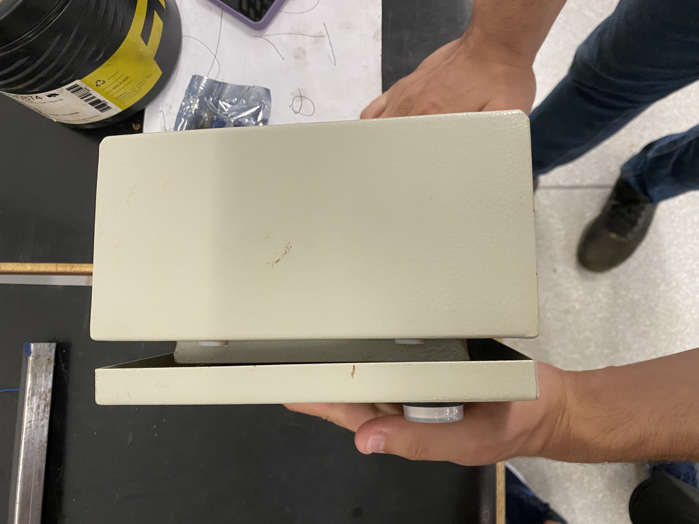
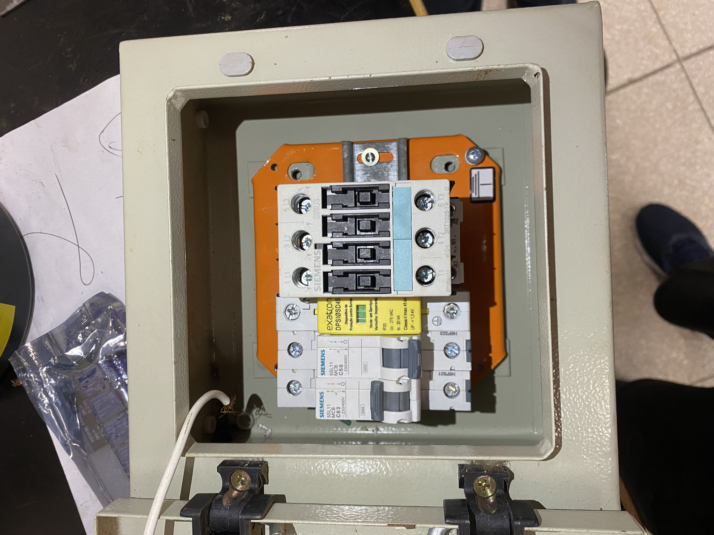
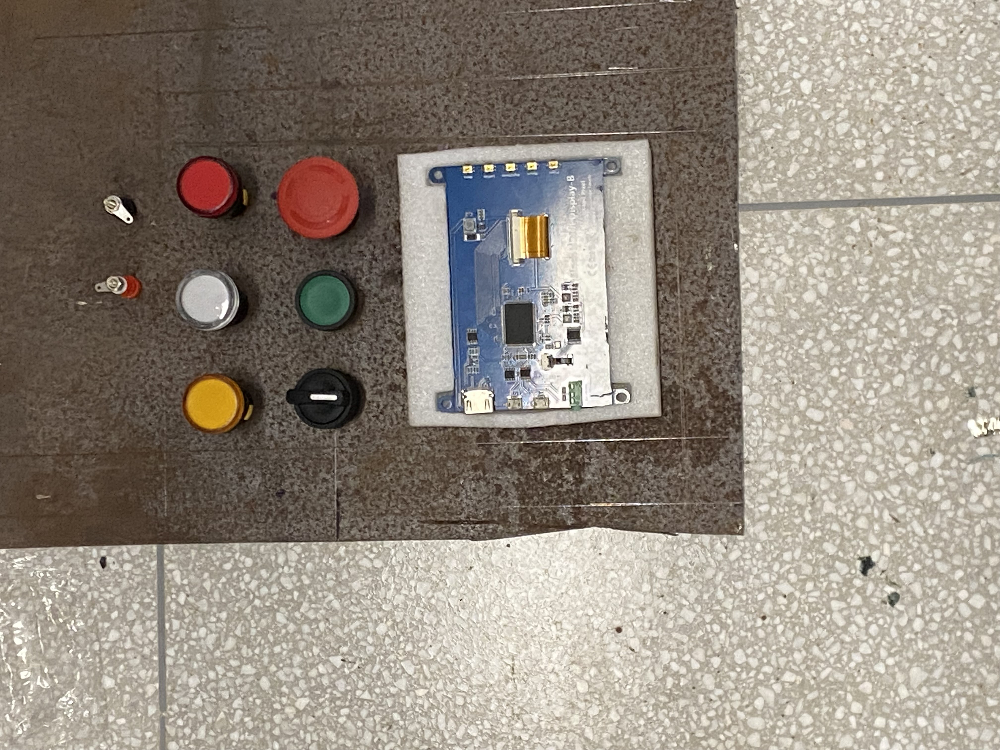

# Montagem do Painel de Segurança

# Introdução

A construção do painel de segurança se deve por conta do sistema de desligamento do carregamento, em casos de falha por temperaturas altas ou falhas de tensão. Seu sistema, já abordado na parte de projeto de subsitema de energia, deve desligar por completo o carregamento e avisar com cores de leds a situação do carregamento, além de poder ligar, tudo sem depender do software.

# Montagem

Utilizando: 2 Disjuntores, sendo 1 de 63A e outro de 50A; 1 Interruptor IDR; 1 DPS de 220V; 1 Fonte Chaveada de 5V 40A bifásica; 1 Botão de Emergência; 1 Botão Pulsante; 1 Módulo Relé de 8 canais 5V; 1 Chave Seletora de 3 posições; 3 Sinaleiros de Led de cores diversas 220V; Contatores e Fios de Cobre.

# Fotos da Montagem

_Centro: Figura 1 - Dimensionamento do quadro elétrico. Fonte: Elaboração própria._

_Centro: Figura 2 - Encaixe dos componentes no trilho do quadro elétrico. Fonte: Elaboração própria._

_Centro: Figura 3 - Dimensionamento dos equipamentos para o painel no EnergyDrive. Fonte: Elaboração própria._

# Conclusão
Os componentes foram alinhados e esperam testes finais.

## Histórico de Revisões

| Versão | Data       | Descrição                       | Autor(a)      |
|--------|------------|---------------------------------|---------------|
| 1.0    | 12/01/2024 | Documento inicial criado       | Matheus Neubern |