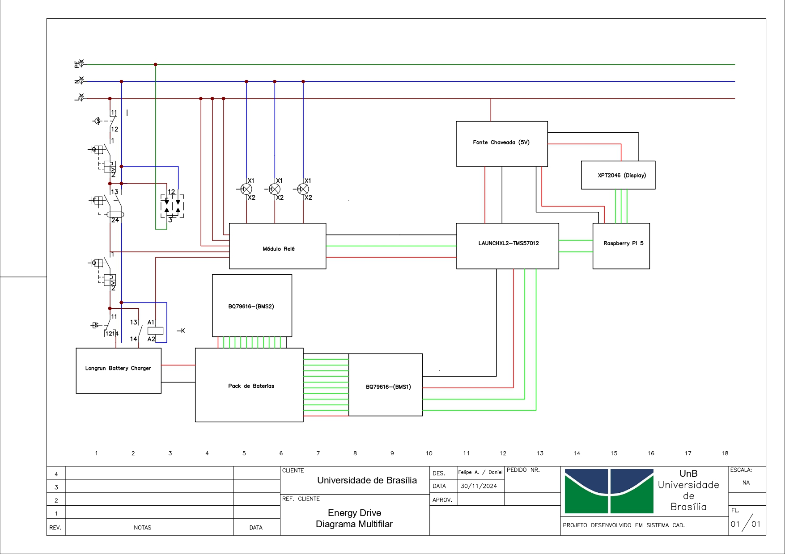

# Projeto do Subsistema de Energia

O subsistema de energia é responsável pela alimentação dos demais subsistemas, garantindo eficiência energética e capacidade de operação. Portanto, o foco da equipe consistiu em dimensionar os gastos energéticos, selecionar componentes eficazes, de baixo consumo e implementar estratégias de gerenciamento de energia em conformidade com as normas de segurança aplicáveis, assegurando a proteção dos usuários e a conformidade com os padrões de qualidade e regulamentações pertinentes.

## 1. Dimensionamento do carregador de baterias

Utilizar um carregador adequado visa garantir a longevidade e o desempenho da bateria. Um carregador que fornece uma corrente inadequada pode comprometer a bateria ocasionando danos, reduzindo a vida útil da bateria ou não carregá-la de maneira eficiente. Os carregadores modernos geralmente seguem normas específicas de segurança, como a ABNT NBR IEC 60335-2-29, que garantem que os dispositivos operem de maneira segura e eficiente.

O projeto EnergyDrive será responsável por recarregar e transportar um acumulador de baterias de íon lítio fixo de dimensões 50,6x35x28,7cm. Portanto, para realizar o carregamento das baterias foi dimensionado um carregador, considerando o número de células em série do acumulador, que afetariam a tensão requerida, bem como o número de células em paralelo para determinar a corrente necessária para o carregamento.

Tabela 1: Especificações do acumulador de baterias utilizadas no dimensionamento do carregador.

| Quantidade de seções | Quantidade total de células em série | Quantidade total de células em paralelo |Tensão individual de carregamento [V]|Tensão total necessária [V] |Corrente necessária [A]|
| ------| --- | ----------- | ---------- |--------- | ---------- |
| 6 | 21 | 20 |3,6| 72 | 40 |

O método de carga escolhido foi o CC-CV (Corrente Constante – Tensão Constante).

1. Fase de corrente constante (CC): Aplica uma corrente constante até atingir a tensão máxima.

2. Fase de tensão constante (CV): Mantém a tensão constante enquanto a corrente diminui.

Tabela 2: Especificações do carregador escolhido.

|Número do modelo|Nome do produto|Marca| Tensão de saída [V DC] | Tensão de entrada [V AC] | Corrente máxima de saída [A] |
|-------|-----|-------| ------| --- | ----------- |
| Q2-3.3kw | 3.3kw on board charger 48v -440v DC | Longrun| 48-440 | 90-265 | 40 |

O carregador possui comunicação CAN 2.0 com baud rate de 125 kbps, 250 kbps, e 500 kbps, além de uma eficiência de 93%.

## 2. Cabos

O dimensionamento dos cabos foi feito de acordo com a norma ABNT NBR 5410, foi escolhido o método G para cabos unipolares espaçados ao ar livre, dispostos na horizontal.

Assim sendo, serão utilizados cabos de 4mm^2 para correntes até 45A e cabos de 6mm^2 para correntes até 59A.

## 3. Diagrama Multifilar

_Figura 1: Diagrama Multifilar. Fonte: Elaboração própria_

## Referências Bibliográficas

[1] Associação Brasileira de Normas Técnicas (ABNT). NBR 5410: Instalações elétricas de baixa tensão. Rio de Janeiro, 2004.

## Tabela de versionamento

| Versão| Data | Descrição | Responsável|
|-------|------|-----------|------------|
| 1.0 | 25/11/2024 | Modificação Unifilar | [Lavynia Sousa](https://gitlab.com/Lavynia) |
| 2.0 | 03/12/2024 | Reestruturação do documento | [Lavynia Sousa](https://gitlab.com/Lavynia) |
