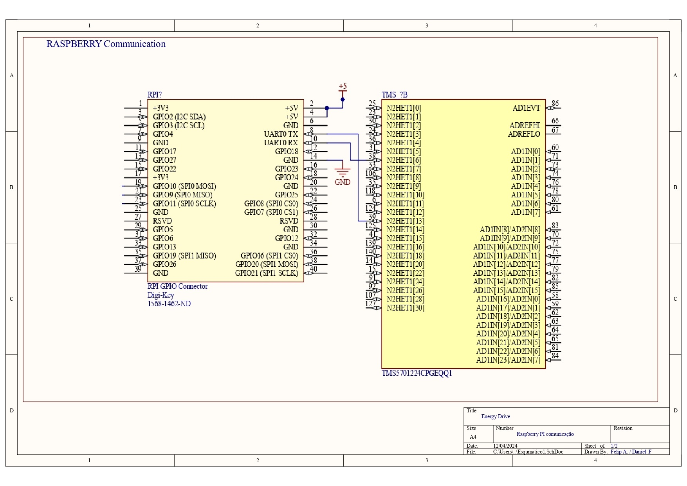
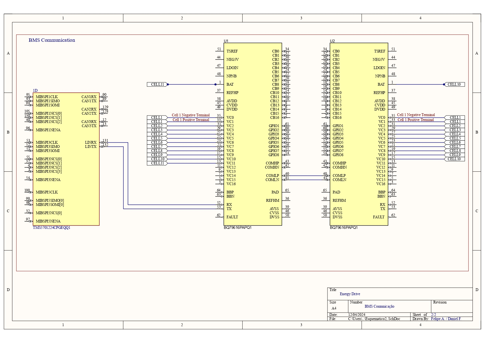
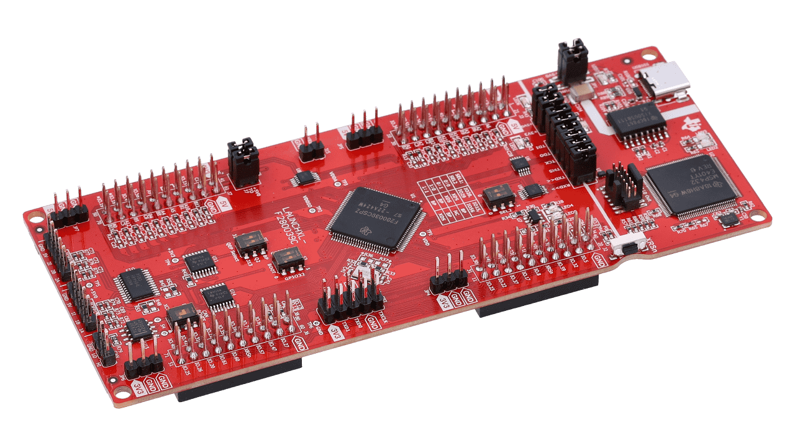
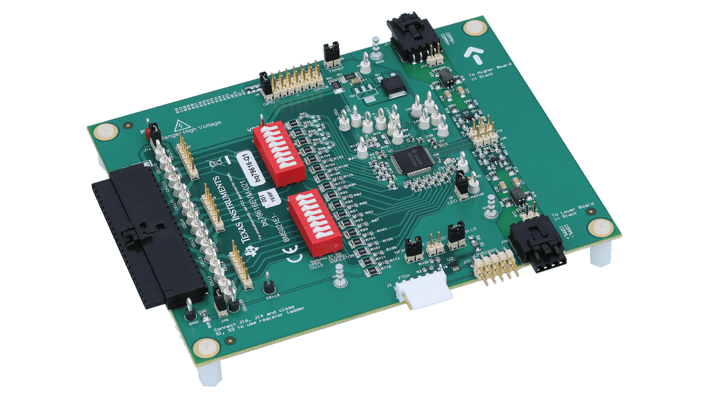
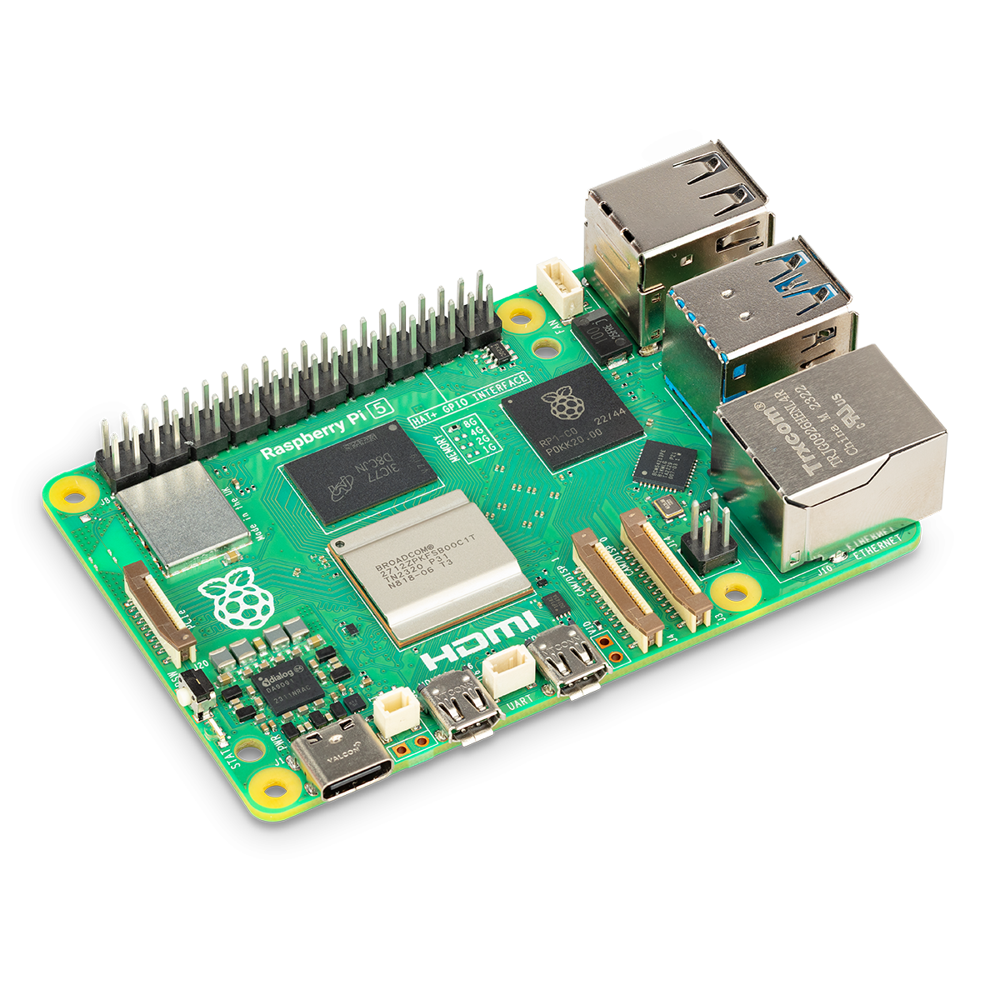

# Projeto do Subsistema de Eletrônica

## 1. Subsistema de Comunicação

O subsistema de comunicação desempenha um papel crucial na integração e operação de sistemas eletrônicos, sendo responsável pela transmissão e recepção de dados entre diferentes módulos e dispositivos. Este subsistema utiliza protocolos específicos para garantir a confiabilidade, a velocidade e a segurança da comunicação, fundamentais para o funcionamento coordenado do sistema como um todo. A seguir esse subsistema será detalhado.

_Figura 1 - Esquemático Comunicação 1. Fonte: Elaboração própria_

_Figura 2 - Esquemático Comunicação 2. Fonte: Elaboração própria_

### 1.1. Comunicação com LAUNCHXL2-TMS57012

O dispositivo utilizado para fazer a ponte de comunicação entre os BMS's (BQ79616) e o microprocessador (Raspberry) consiste na placa de desenvolvimento LAUNCHXL2-TMS7012, tal dispositivo utiliza o processador ARM CORTEX R4-F como principal centro de processamento dos dados.

Com relação aos periféricos de protocolo de comunicação, há a disponibilidade de protocolo I2C, CANbus, CAN e SPI, onde o protocolo escolhido para uso consiste no CANbus devido a sua robustez e facilidade de implementação. Onde o microcontrolador obterá os dados de tensão e temperatura aquisitados pelos BMS's e enviará para a Raspberry.

#### 1.1.1. Placa de desenvolvimento LAUNCHXL2-TMS57012

_Figura 3 - Microcontrolador TMS57012_

#### 1.1.2. BQ79616 - EVM

_Figura 4 - Battery Manegement System BQ79616_

### 1.2. Comunicação com Raspberry PI 3

Com relação a comunicação realizada pela Raspberry, serão utilizados dois protocolos de comunicação, o protocolo CANbus será utilizado para recebimento dos dados, onde serão recebidos parâmetros de segurança como nivel de tensão e temperatura das células, o protocolo Wi-Fi que fara comunicação com dispositivos móveis com a finalidade de salvar os parâmetros em banco de dados e disponibilizar comandos remotos para o carrinho de carregamento.

#### 1.2.1. Raspberry PI 3

_Figura 5 - Raspberry Pi 5_

## Tabela de versionamento

| Versão | Data       | Descrição                 | Responsável                                                                                   |
| ------ | ---------- | ------------------------- | --------------------------------------------------------------------------------------------- |
| 1.0    | 01/12/24   | Primeira Versão           | Daniel Félix                                                                                  |
| 2.0    | 01/12/24   | Edição dos Esquemáticos   | Felipe Andrade                                                                                |
| 2.1    | 01/12/24   | Inclusão de Imagens       | Felipe Andrade                                                                                |
| 2.2    | 01/12/24   | Inclusão de esquemáticos  | Lavynia Sousa                                                                                 |
| 2.3    | 01/12/24   | Alteração de esquemáticos | Felipe Andrade                                                                                |
| 2.4    | 14/01/2025 | Atualização documento     | [Erick levy](https://gitlab.com/Ericklevy) e [Rodrigo Carvalho](https://gitlab.com/RocSantos) |
| 2.4    | 19/02/2025 | Atualização Esquemático     | [Erick levy](https://gitlab.com/Ericklevy) e [Rodrigo Carvalho](https://gitlab.com/RocSantos) |
