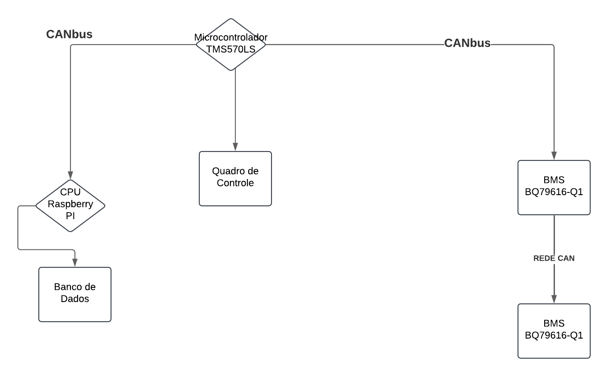
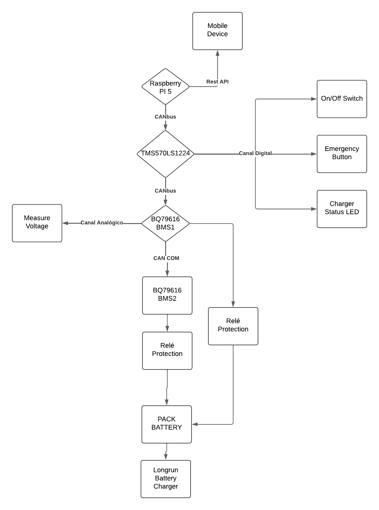
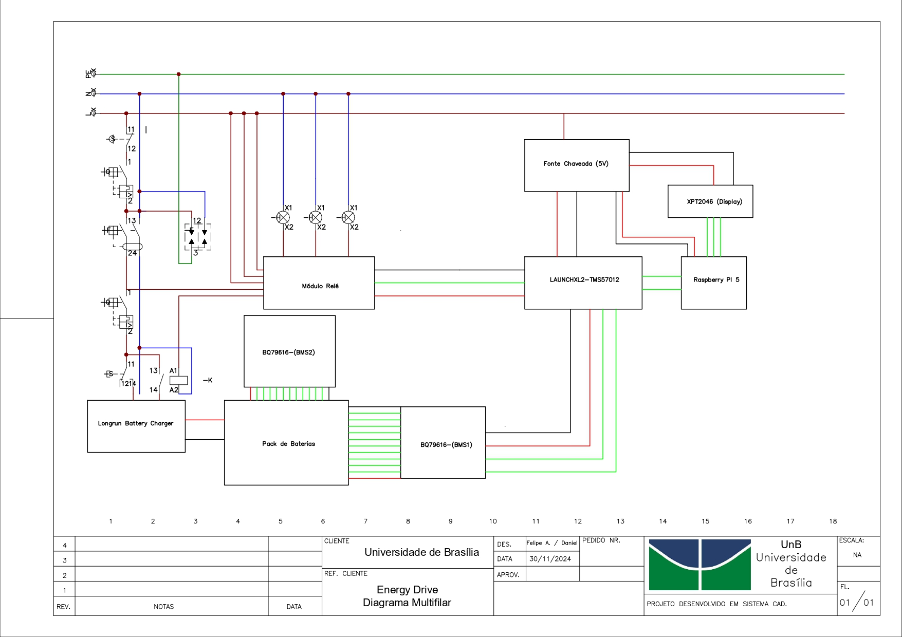

# Arquitetura do Subsistema Eletrônico e de Energia

O desenvolvimento do subsistema eletrônico é essencial para garantir o controle preciso e eficiente do sistema, a arquitetura pensada para a solução do problema tem como princípio básico realizar o carregamento do pack de baterias de forma segura e adequada.

A arquitetura do subsistema de energia foi projetada para garantir o fornecimento eficiente, seguro e confiável de energia para o carregamento do pack de baterias. Este subsistema abrange os componentes relacionados ao armazenamento, distribuição e monitoramento de energia, sendo essencial para o funcionamento contínuo e seguro de outros sistemas.

Dessa forma, a arquitetura é composta pelos seguintes subsistemas básicos, ilustrados pela tabela abaixo:

## Subsistema de Eletrônica

| Subsistema                   | Descrição                                                                                                                                                                                                                         |
| ---------------------------- | --------------------------------------------------------------------------------------------------------------------------------------------------------------------------------------------------------------------------------- |
| Subsistema de Balanceamento  | É composto por 2 BMS (Battery Management System) que possuem a função de gerenciar o balanceamento das baterias e reportar os dados de tensão e temperatura das células do pack de baterias.                                      |
| Painel de controle e comando | O painel elétrico é responsável realizar os comandos de forma manual e no local, sem necessidade de acionamento remoto.                                                                                                           |
| Microcontrolador             | O microcontrolador centraliza todas as informações de controle e comando e também se comunica com os BMS recebendo seus dados e determinando sua forma de operação em cada cenário.                                               |
| CPU                          | É composto por um microcomputador que realiza o armazenamento essas informações para pós processamento de dados e análise. Além disso a CPU se comunica com um celular pelo qual é possível realizar os comandos de forma remota. |

## Subsistema de Energia

| Subsistema                     | Descrição                                                                                                                                                        |
| ------------------------------ | ---------------------------------------------------------------------------------------------------------------------------------------------------------------- |
| Subsistema de alimentação      | É composto pela entrada de energia da rede alimentação, um sistema de proteção e seccionamento, e uma fonte chaveada para alimentação dos circuitos eletrônicos. |
| Carregador AC-DC para baterias | Carregador corretamente especificado para o pack de baterias utilizado pela equipe de competição.                                                                |

## Diagramas

### Diagrama de blocos simplificado

O subsistema eletrônico e de energia, é ilustrado por meio do seguinte diagrama de blocos simplificado da solução.

_Figura 1 - Diagrama de blocos simplificado. Fonte: Elaboração própria_

### Diagrama de blocos detalhado

_Figura 2 - Diagrama de blocos detalhado. Fonte: Elaboração própria_

### Diagrama Multifilar

_Figura 3 -Diagrama Multifilar. Fonte: Elaboração própria_

| Componente do Subsistema de Energia         | Descrição                                                   |
| ------------------------------------------- | ----------------------------------------------------------- |
| Dispositivo de Proteção contra Surtos (DPS) | Protetor Surto Dps Clamper Anti Raio Vcl 275V 45kA Front.   |
| Disjuntor                                   | Disjuntor Weg Monopolar Curva C 40A 50A 63A                 |
| Dispositivo Diferencial Residual (DR)       | DR Interruptor Diferencial Residual 2p 40A 30mA Ac Decorlux |
| Contator                                    | Contator Tripolar Weg CWM40-00 60A 220V                     |
| Carregador AC-DC para baterias              | Longrun Lifepo4 Battery Charger                             |
| Fonte chaveada                              | Fonte Chaveada Eletronica 5V 40A 200W Bivolt 110V 220V      |

| Componente do Subsistema de Eletrônica | Descrição                                                   | Quantidade  |
| -------------------------------------- | ----------------------------------------------------------- | ----------- |
| Pack de baterias                       | NCR21700 Panasonic                                          | 420 células |
| Sistema de monitoramento de baterias   | BQ79616 Texas Instruments                                   | 2           |
| Módulo Relé                            | Módulo Relé Optoacoplado 4 Canais 5v P/ Automação, Robótica | 1           |
| Microcontrolador                       | LAUNCHXL2-TMS57012                                          | 1           |
| Raspberry                              | PI 5                                                        | 1           |

## Versionamento

| Versão | Data       | Descrição                                          | Autor(a)                                                                                      |
| ------ | ---------- | -------------------------------------------------- | --------------------------------------------------------------------------------------------- |
| 1.0    | 24/11/2024 | Documento inicial criado                           | Felipe Andrade                                                                                |
| 2.0    | 04/12/2024 | Atualização da arquitetura de energia e eletrônica | [Lavynia Sousa](https://gitlab.com/Lavynia)                                                   |
| 2.1    | 14/01/2025 | Atualização documento                              | [Erick levy](https://gitlab.com/Ericklevy) e [Rodrigo Carvalho](https://gitlab.com/RocSantos) |
| 2.2    | 14/01/2025 | Atualização final documento                              | [Erick levy](https://gitlab.com/Ericklevy) e [Rodrigo Carvalho](https://gitlab.com/RocSantos) |