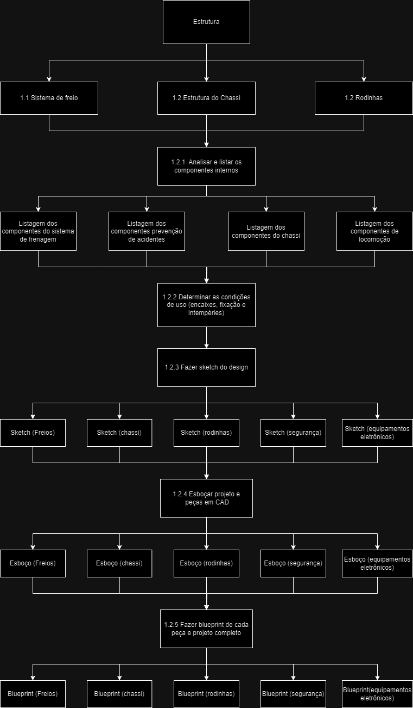

# Estrutura Analítica do Projeto - EAP 

A Estrutura Analítica do Projeto (EAP) da área de Estruturas irá descrever as atividades a serem desenvolvidas em ordem de execução e a partir das entregas espituladas nos pontos de controle, como é possível visualizar na figura 1.
Estruturas

    Figura 1 - EAP de Estruturas  
    Fonte: Autores.

## Versionamento
| Versão | Data | Modificação | Autor |
|--|--|--|--|
| 1.0 | 20/11/2024 | Criação do EAP de Estruturas | [Carlos Eduardo](https://gitlab.com/a.cadu), [Gabriellen Ferreira](https://gitlab.com/Gabriellen8) , [Ismael Andrade](https://gitlab.com/IsmaelAndrade) e [Kleyson Silva](https://gitlab.com/KleysonNacarat) |

