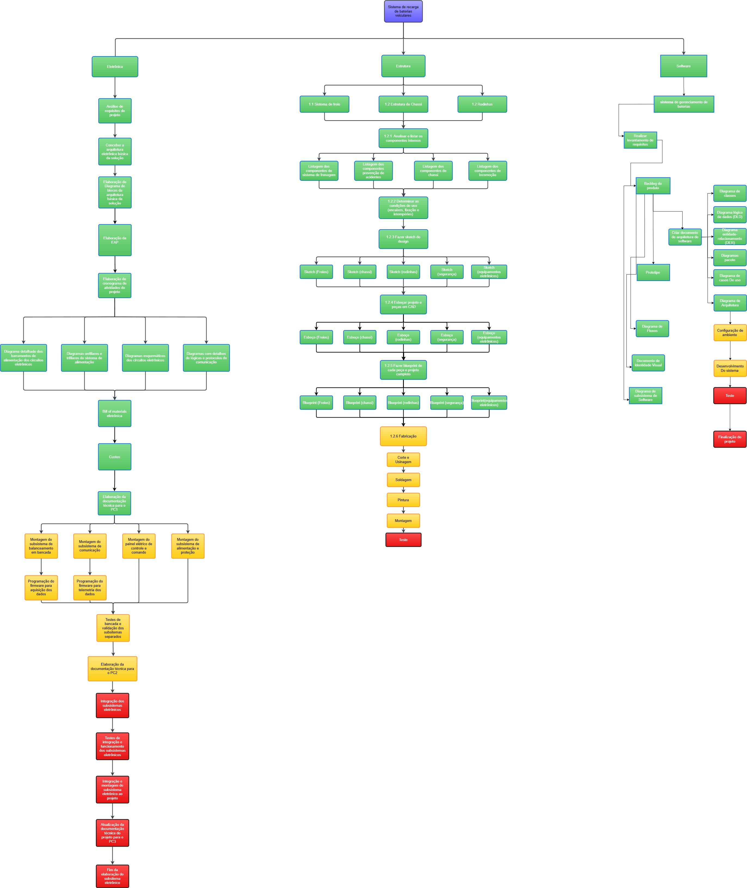

# Estrutura Analítica do Projeto (EAP)

## Introdução

A Estrutura Analítica do Projeto (EAP) é uma metodologia fundamental no gerenciamento de projetos. Ela proporciona uma abordagem sistemática e hierárquica para decompor as entregas e atividades do projeto em componentes menores, facilitando o planejamento, a execução e o controle do projeto.

## Estrutura da EAP

A EAP organiza-se em três níveis principais, representados por cores, cada cor está relacionada a um ponto de controle. Dessa forma, garantindo uma visão clara e detalhada das atividades necessárias para a realização do projeto:

- **Nível 1: Verde** - Engloba todas as atividades necessárias para o desenvolvimento dos entregáveis para o ponto de controle 1 (PC1).

- **Nível 2: Amarelo** - Engloba todas as atividades necessárias para o desenvolvimento dos entregáveis para o ponto de controle 2 (PC2).

- **Nível 3: Vermelho** - Engloba todas as atividades necessárias para o desenvolvimento dos entregáveis para o ponto de controle 3 (PC3).

## Visualização da EAP

A representação gráfica da EAP é realizada através de um diagrama hierárquico, que ilustra todas as atividades do projeto de forma estruturada. Este diagrama é uma ferramenta vital para a comunicação clara das expectativas e responsabilidades entre a equipe de projeto.

_Centro: Figura 1 - Diagrama da EAP. Fonte: Elaboração própria._

## Conclusão

A implementação eficaz da EAP é crucial para o sucesso do projeto, assegurando que todas as atividades sejam identificadas, planejadas e executadas de maneira eficiente. A EAP geral é utilizada e melhor detalhada no cronograma do projeto, onde cada elemeneto é melhor descrito e é condionado a um responsável e um prazo de desenvolvimento é estabelecido.
## Referências

- EAP: o que é e como fazer uma Estrutura Analítica do Projeto. Disponível em: <https://artia.com/blog/como-fazer-eap-na-gestao-de-projetos/>. Acesso em: 22 de outubro de 2024.

## Histórico de Revisões

| Versão | Data       | Descrição                       | Autor(a)      |
|--------|------------|---------------------------------|---------------|
| 1.0    | 25/11/2024 | Documento inicial criado       | [Felipe Andrade](https://gitlab.com/Felipe_Andrade) |
