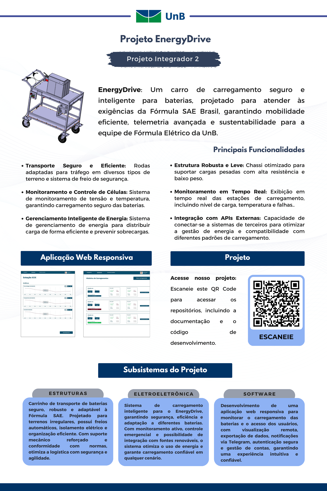

   

# EnergyDrive - Projeto de Carro para Carregamento de Baterias

<iframe width="100%" height="350px" src="https://www.youtube.com/embed/zurikwm6xgg" frameborder="0" allow="accelerometer; autoplay; clipboard-write; encrypted-media; gyroscope; picture-in-picture" allowfullscreen></iframe>

## Ideia

Desenvolver um carro de carregamento e transporte para acumuladores de baterias, visando atender às necessidades da equipe de Fórmula Elétrico da UnB na competição Fórmula SAE Brasil.

## Problema

A competição Fórmula SAE Brasil exige que os carros, tanto a combustão quanto elétricos, passem por inspeções técnicas rigorosas. A equipe de Fórmula Elétrico da UnB precisa de um carro de carregamento que forneça dados do estado das baterias, garanta a segurança mecânica do acumulador e ofereça isolação galvânica para o usuário.

## Solução

Construir um "Accumulator Hand Cart" que atenda às normas da competição FSAE. O carrinho deve:

- Transportar pacotes de baterias de forma segura, tanto eletricamente quanto mecanicamente.
- Realizar o carregamento das baterias respeitando requisitos de isolação galvânica e características nominais de corrente, tensão e temperatura.
- Fornecer telemetria robusta e segura para garantir o gerenciamento adequado do carregamento.

## Requisitos

### Mobilidade

- Deslocamento seguro do pacote de baterias com mínimo esforço, mesmo em terrenos inclinados.
- Sistema de freio de segurança.

### Sustentabilidade

- Utilização de energia de fontes renováveis, como painéis solares instalados no carro.

### Monitoramento e Controle

- Sistema de software embarcado para monitoramento da carga, previsão de necessidades de energia e controle remoto das operações de carregamento.

### Segurança e Confiabilidade

- Sistemas de segurança para evitar sobrecargas e garantir operação estável.
- Compartimento específico para extintor próprio para células de lítio.

## Grupo de Mecânica

### Projeto Robusto e Leve

- Chassi otimizado para minimizar o peso sem comprometer a resistência.

### Sistema de Frenagem

- Equipamento com sistema de frenagem para segurança ao locomover o carrinho.

### Compartimento Extra

- Espaço para transporte de ferramentas úteis, como multímetros.

## Grupo de Energia/Eletrônica

### Sistema de Gerenciamento de Energia

- Baterias de alta capacidade e sistema inteligente de gerenciamento de energia para carregamento seguro e eficiente.

### Conversores de Potência

- Adaptação a diferentes tipos de baterias de veículos elétricos, permitindo carregamento rápido e seguro.

### Fontes de Energia Renovável

- Equipamento com painéis solares para auxiliar no carregamento das baterias internas durante a operação.

## Grupo de Software

### Aplicação Web responsiva

- Desenvolvimento de uma aplicação web, que pode ser usada através de um navegador em um aparelho móvel ou computador. Tem o propósito de monitorar o estado de carregamento das células, permitindo gerenciamento remoto em caso de falhas e controle do carregamento.

## Videos do funcionamento do projeto

### Video do EnergyDrive Web

<iframe width="100%" height="350px" src="https://youtube.com/embed/8v3S3ORQtnE" frameborder="0" allow="accelerometer; autoplay; clipboard-write; encrypted-media; gyroscope; picture-in-picture" allowfullscreen></iframe>

### Video do EnergyDrive Subsistemas fisico

<iframe width="100%" height="350px" src="https://youtube.com/embed/Cz_lPY7Kgts?feature=share" frameborder="0" allow="accelerometer; autoplay; clipboard-write; encrypted-media; gyroscope; picture-in-picture" allowfullscreen></iframe>
