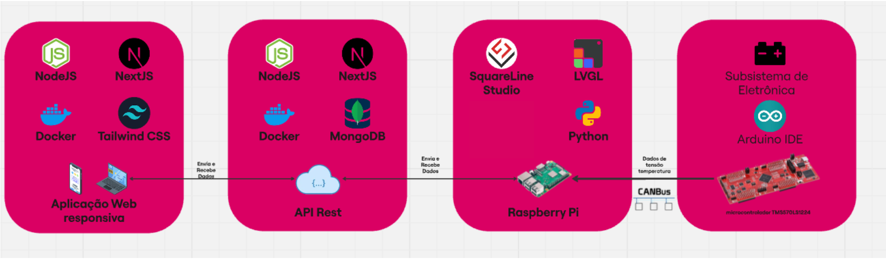

# Documento de Arquitetura de Software

## 1. Introdução

### 1.1. Finalidade

Este documento oferece uma visão geral arquitetural abrangente do sistema, usando diversas visões arquiteturais para representar diferentes aspectos do sistema. O objetivo deste documento é capturar e comunicar as decisões arquiteturais significativas que foram tomadas em relação ao sistema.

### 1.2. Escopo

Esse documento serve de guia para outros tópicos da construção arquitetural do software, abordando os principais pontos desenvolvidos na arquitetura do projeto, a partir desse breve resumo de cada tópico é possível se orientar com relação a outros documentos da arquitetura desenvolvidos no projeto, onde é possível ter uma visão detalhada de cada tema.

### 1.3. Definições, Acrônimos e Abreviações

- API: É um acrônimo para Application Programming Interface(Interface de Programação de Aplicações). A API é um conjunto de definições e protocolos usado no desenvolvimento e na integração de software de aplicações, permitindo que um serviço interaja com outros produtos e serviços sem a necessidade de saber como eles foram implementados.
- AWS: É um acrônimo para Amazon Web Services. O AWS é uma plataforma de serviços de computação em nuvem.
- DB: É um acrônimo para database(Banco de Dados), local onde persistem os dados que devem ser salvos pela aplicação.
- HTML: É um acrônimo para HyperText Markup Language(Linguagem de Marcação de Hipertexto). O HTML é o bloco de construção mais básico da web. Define o significado e a estrutura do conteúdo da web.
  \*HTTP: É um acrônimo para Hypertext Transfer Protocol(Protocolo de Transferência de Hipertexto). O HTTP é um protocolo que permite a obtenção de recursos, como documentos HTML.
- REST: É um acrônimo para Representational State Transfer(Transferência Representacional de Estado). O REST é um conjunto de princípios de arquitetura. Os desenvolvedores podem implementar a arquitetura REST de maneiras variadas.
- UML: É um acrônimo para Unified Modeling Language(Linguagem de Modelagem Unificada). O UML é uma linguagem utilizada para visualizar, especificar, construir e documentar a arquitetura completa de um software, fornecendo informações necessárias para que o desenvolvedor implemente o software.

## 2. Representação Arquitetural

### 2.1. Tecnologias

#### Frontend

- **React**: O React é uma biblioteca JavaScript de código aberto focada na criação de interfaces de usuário (UIs) interativas e reutilizáveis. Foi escolhido por sua popularidade, documentação abrangente e grande comunidade ativa, o que facilita o aprendizado e a resolução de dúvidas pela equipe.

- **Redux**: O Redux é uma biblioteca de gerenciamento de estado previsível para aplicativos JavaScript. Ele será usado em conjunto com o React para gerenciar de forma eficiente o estado global da aplicação, garantindo uma arquitetura bem organizada e escalável.

- **Next.js**: O Next.js será utilizado para o desenvolvimento do frontend e backend, integrando as funcionalidades do React com otimizações como renderização do lado do servidor (SSR) e geração de páginas estáticas (SSG), além de permitir o gerenciamento eficiente de rotas e APIs.

#### Backend

- **Next.js**: Além de ser usado no frontend, o Next.js também será utilizado para implementar o backend da aplicação. Ele permitirá a criação de APIs simplificadas e integradas ao projeto, facilitando a comunicação entre o frontend e o banco de dados.

- **MongoDB**: O MongoDB é um banco de dados NoSQL orientado a documentos que será usado para armazenar os dados da aplicação. Sua flexibilidade e escalabilidade foram os principais fatores para a escolha, além de sua integração facilitada com o Next.js.

## 3. Metas e Restrições da Arquitetura

### 3.1 - Restrições

- O software deve ser desenvolvido nas tecnologias definidas;
- O software deve rodar nos navegadores: Web Firefox e Google Chrome;
- O ambiente de desenvolvimento do software deve funcionar tanto em Windows, Linux e MacOS;
- Para utilizar o software é necessário ter internet;
- O escopo do projeto deve ser concluído até o final da disciplina.

### 3.2 - Metas

As metas planejadas para a aplicação são:

- **Usabilidade** - O software deve possuir alta aprendibilidade e inteligibilidade, para que atenda aos requisitos elicitados no formulário criado pelo grupo;
- **Manutenibilidade** - O código e as documentações realizadas pelo grupo devem estar num nível de qualidade, seguindo os padrões de projeto e bibliografia, onde a sua manutenção seja fácil de ser realizada.

## 4. Visão geral das aplicações

A figura a seguir mostra as aplicações que serão desenvolvidas, e como se dá a comunicação entre elas e a solução de eletrônica.A aplicação web deve além de mostrar dados, possuir formas de controlar o carregamento.

  <b>Figura 1: Representação visual das aplicações</b> (Fonte: Autoria Própria)

## 5. Tamanho e Desempenho

### 5.1 Visão Geral

Discrição do desempenho e das características do software que impactam na arquitetura de software.

### 5.2 Requisitos Mínimos

- É necessário possuir conexão com a internet;
- Navegador com suporte a HTML 5, CSS e JavaScript;
- Camera para a I.A. fazer o reconhecimento.
- Raspberry pi capaz de se conectar com hardware e integrar com o servidor web;
- Para desenvolvimento de possuir: Windows, Linux ou MacOS;

## 9. Qualidade

Qualidade de software tem como objetivo atingir requisitos especificados durante a elaboração do projeto, e as necessidades ou expectativas de usuários e clientes, estando relacionado diretamente com: escalabilidade, manutibilidade, confiabilidade, usabilidade e assim por diante.

## Versionamento

| Data       | Versão | Descrição                   | Autor(es)                                                                                               |
| ---------- | ------ | --------------------------- | ------------------------------------------------------------------------------------------------------- |
| 22/11/2024 | 1.0    | Documento de Arquitetura V1 | [Abdul Hannan](https://gitlab.com/hannanhunny01)                                                        |
| 05/12/2024 | 1.1    | Entidade Relacionamento V1  | [Rodrigo Santos](https://gitlab.com/RocSantos) e [Antônio Rangel](https://gitlab.com/antonio.rangel.02) |
| 14/01/2025 | 2.0    | Atualização documento       | [Erick levy](https://gitlab.com/Ericklevy) e [Rodrigo Carvalho](https://gitlab.com/RocSantos)           |
| 19/02/2025    | 2.1 | Atualização final documento  | [Erick levy](https://gitlab.com/Ericklevy) e [Rodrigo Carvalho](https://gitlab.com/RocSantos) |
