# Documento de Identidade

## Visão geral

O guia de estilo é um conjunto de diretrizes que estabelece padrões e regras para a escrita e apresentação de design para um produto. Tem como principal objetivo ajudar a manter a consistência na comunicação visual do projeto, aumentando a sua legibilidade, reconhecimento e memorização pelo público-alvo.

## Logo e Identidade Visual

<b>Imagem 1: Logo Principal</b> (Fonte: Autoria Própria)

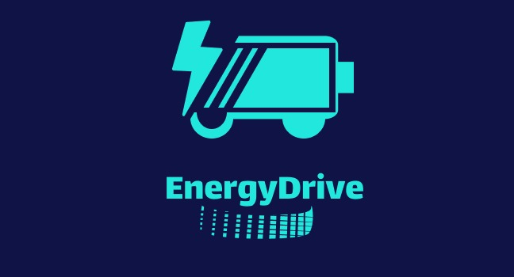

<b>Imagem 2: Logo Recolorida</b> (Fonte: Autoria Própria)

## Cores
Cores principais: #0B4F6C e #FBFBFF 

Cores secundárias: #757575 e #01BAEF

Cores terciárias: #6C0E23 e #20BF55

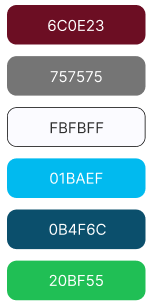

<b>Imagem 3: Cores</b> (Fonte: Autoria Própria)

## Tipografia
A família tipográfica principal será Poppins e suas variações.

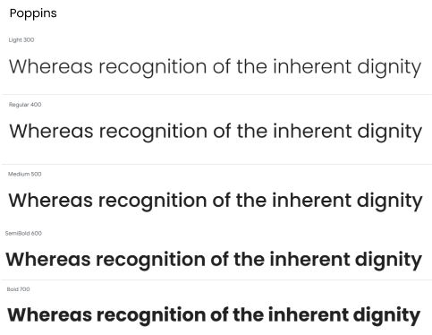

<b>Imagem 4: Fontes</b> (Fonte: Google Fonts)

## Ícones e Elementos Gráficos
Os ícones são obtidos a partir da biblioteca [fontawesome](https://fontawesome.com/icons).

<b>Imagem 5: Icone de Configuração</b> (Fonte: fontawesome)

<b>Imagem 6: Icone de Notificação</b> (Fonte: fontawesome)

<b>Imagem 7: Icone de Edição</b> (Fonte: fontawesome)

<b>Imagem 8: Icone de Saída</b> (Fonte: fontawesome)

Para os gráficos será utilizado com base nos componentes da biblioteca [tailwindui](https://tailwindui.com/components).

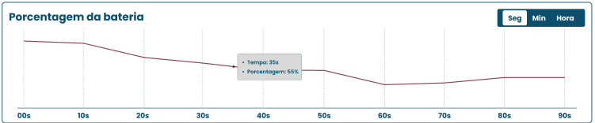

<b>Imagem 9: Gráficos</b> (Fonte: tailwindui)

## Layout e Grid:
Dois grids principais, um para logins e cadastro e outro para visualização de dados da aplicação.

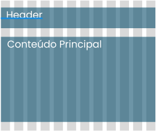

<b>Imagem 10: Grid Principal</b> (Fonte: Autoria Própria)

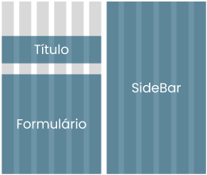

<b>Imagem 11: Grid Login/Cadastro</b> (Fonte: Autoria Própria)

# Documento de Identidade Visual

O documento se encontra no [Figma](https://www.figma.com/design/3xoQ00lTBBhyQRMNTaK1aq/Arthur-Melo's-team-library?node-id=340-2).

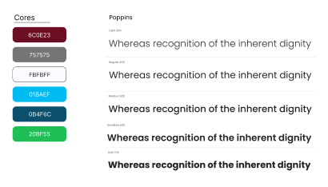

<b>Imagem 12: Tipografia e Cores</b> (Fonte: Autoria Própria)

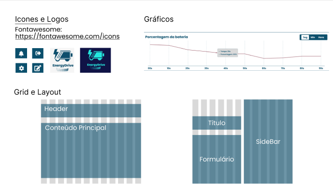

<b>Imagem 13: Icones, Grid e Logo</b> (Fonte: Autoria Própria)

# Protótipo de Alta Fidelidade

O protótipo pode ser encontrado no [Figma](https://www.figma.com/design/3xoQ00lTBBhyQRMNTaK1aq/Arthur-Melo's-team-library?node-id=0-1).

### Tela de Login

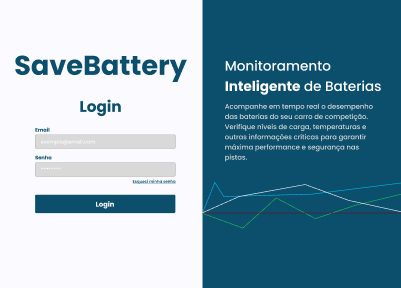

<b>Imagem 14: Tela de Login</b> (Fonte: Autoria Própria)

### Tela de Cadastro

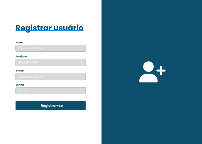

<b>Imagem 15: Tela de Cadastro</b> (Fonte: Autoria Própria)

### Tela de Listar Usuários

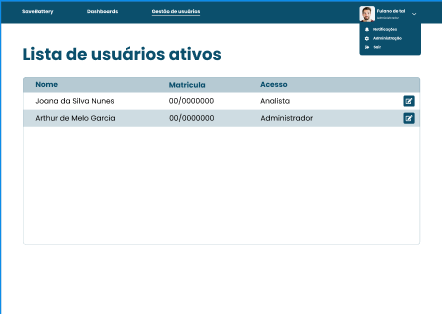

<b>Imagem 16: Tela de Listar Usuários</b> (Fonte: Autoria Própria)

### Tela de Visualizar Estações

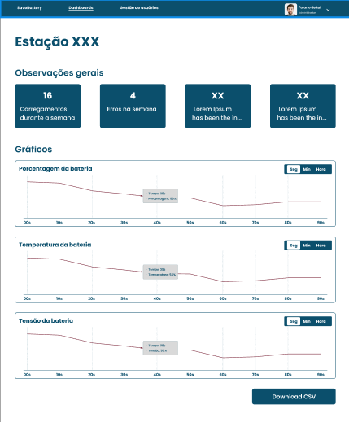

<b>Imagem 17: Tela de Visualizar Estações</b> (Fonte: Autoria Própria)

## Tabela de versionamento

| Versão| Data | Descrição | Responsável|
|-------|------|-----------|------------|
| 0.1 | 06/12/2024 | Criação do documento | [Cibele Goudinho](https://gitlab.com/CibeleG) |
