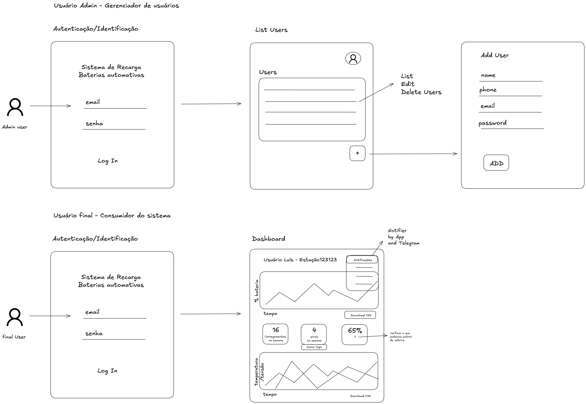

# Protótipo

 Esta sessão elenca todos os elementos relacionados a prototipação do software.

## Protótipo de baixa fidelidade

Protótipos de baixa fidelidade são representações simplificadas do sistema, geralmente criadas com ferramentas como papel e caneta ou aplicações que permitem rascunhos digitais, como o Excalidraw. Esses protótipos são úteis para brainstorming, exploração inicial de ideias e feedback rápido de stakeholders, ajudando a identificar problemas de usabilidade e funcionalidades antes do desenvolvimento mais detalhado.

<b>Figura 1 - Protótipo de baixa fidelidade</b> (Fonte: Autoria Própria)

## Protótipo de alta fidelidade

Protótipos de alta fidelidade representam com maior detalhamento a aparência e o comportamento do sistema final. Criados com ferramentas como o Figma, esses protótipos incluem elementos visuais, interações e fluxos que simulam a experiência do usuário. Eles são fundamentais para refinar detalhes visuais, realizar testes de usabilidade mais precisos e alinhar as expectativas com stakeholders antes de iniciar o desenvolvimento do produto.

<iframe style="border: 1px solid rgba(0, 0, 0, 0.1);" width="800" height="450" src="https://embed.figma.com/design/3xoQ00lTBBhyQRMNTaK1aq/Arthur-Melo's-team-library?node-id=0-1&embed-host=share" allowfullscreen></iframe>

<b>Figura 2 - Protótipo de alta fidelidade</b> (Fonte: Autoria Própria)

### Tecnologias utilizadas

[1][Excalidraw](https://excalidraw.com/)

[2][Figma](https://www.figma.com/pt-br/)

## Referências

- Softdesign. Disponível em: https://softdesign.com.br/blog/prototipo-baixa-e-alta-fidelidade/. Acessado em: 19 de dez de 2024.

## Tabela de versionamento

| Versão | Data       | Descrição                                           | Responsável                                                        |
| ------ | ---------- | --------------------------------------------------- | ------------------------------------------------------------------ |
| 1.0    | 15/11/2024 | Criação da estrutura do documento                   | [Luís Fernando Furtado de Araújo](https://gitlab.com/luis-furtado) |
| 1.1    | 16/11/2024 | Adição do protótipo de baixa no documento           | [Luís Fernando Furtado de Araújo](https://gitlab.com/luis-furtado) |
| 1.2    | 25/11/2024 | Adição do protótipo de alta fidelidade no documento | [Eliás Yousef](https://gitlab.com/eliasyousef)                     |
| 1.3    | 19/12/2024 | Correção de legenda das imagens                     | [Vitor Diniz](https://gitlab.com/vitordiniz25)                     |
| 1.4    | 19/12/2024 | Adicionando referências e texto introdutório        | [Vitor Diniz](https://gitlab.com/vitordiniz25)                     |
